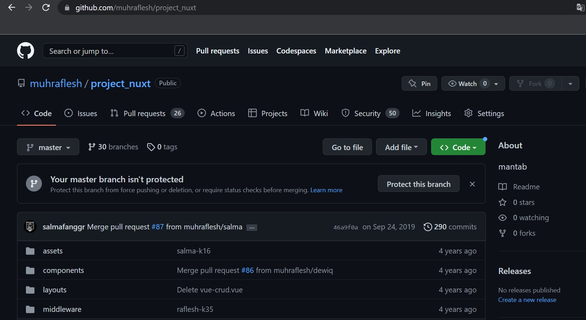
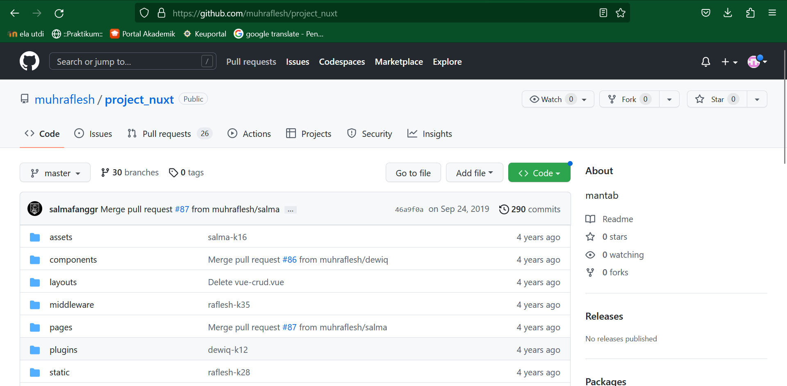
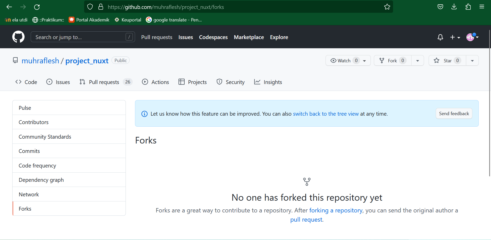
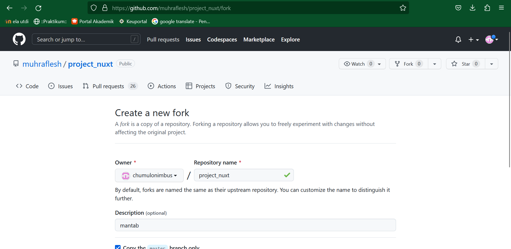
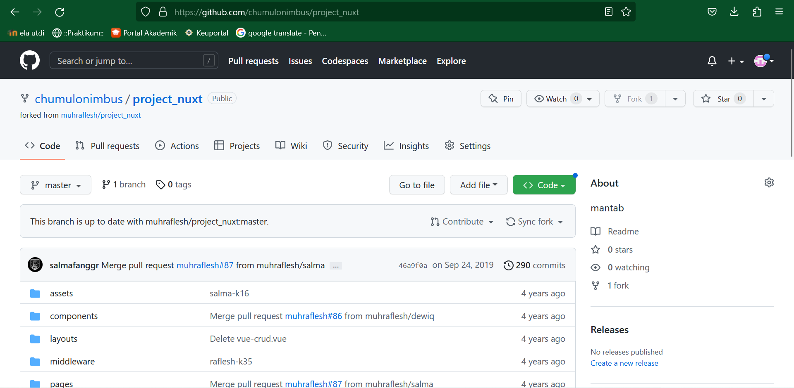
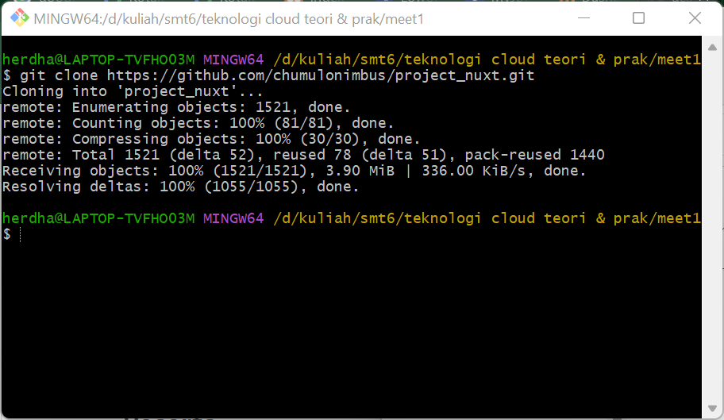

Fork
=====================

Kontributor harus mem-fork repo upstream author sehingga di repo kontributor muncul repo tersebut. Proses forking ini dijelaskan dengan langkah-langkah berikut:

    1. Login ke GitHub
    2. Akses repo yang akan di-fork: https://github.com/muhraflesh/project_nuxt
    

    
    3. Pada sisi kanan atas, klik Fork:
    

    4. Pilih akan ditempatkan di account mana.
    

    5. Setelah proses, repo dari upstream author sudah berada di account GitHub kontributor
    

    6. Setelah proses tersebut, clone di komputer lokal kontributor
    
