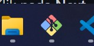
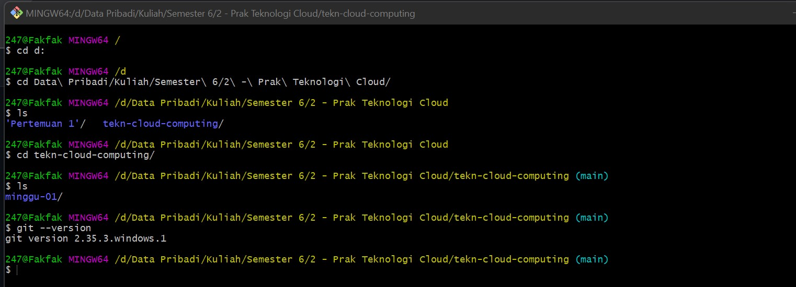
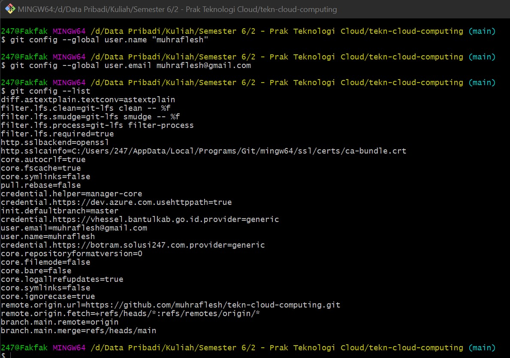
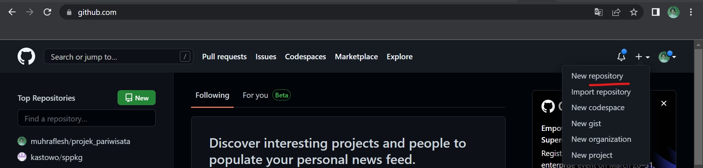
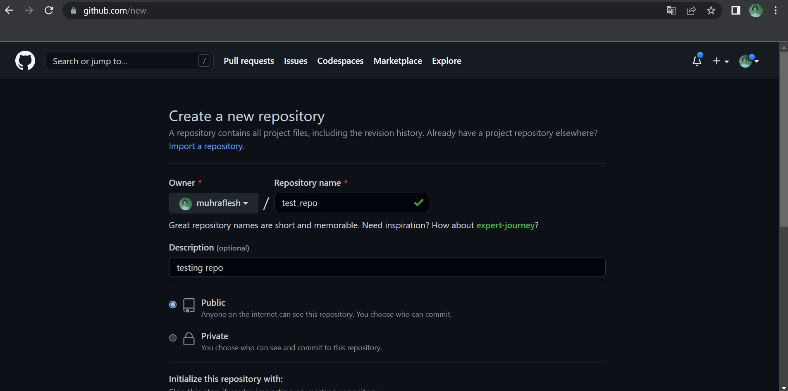
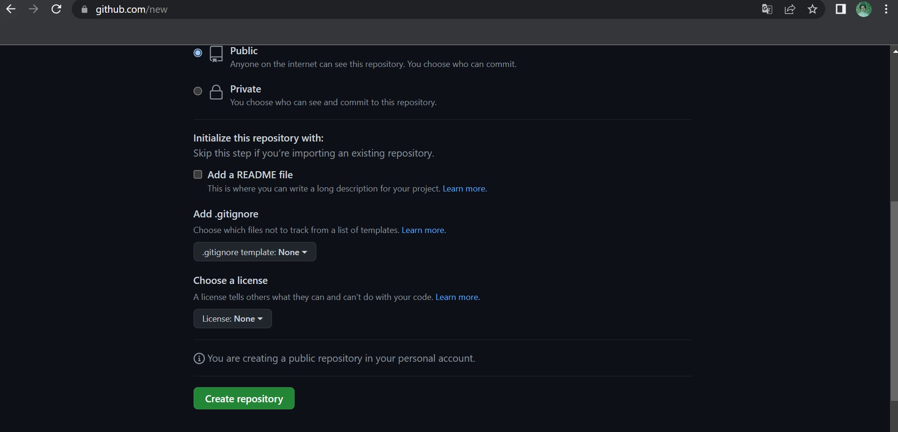
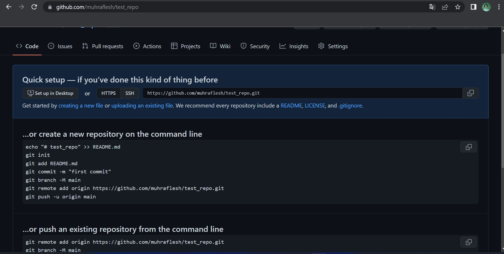

Materi RTFM Nomor 1-3
=====================

1. Install Git
--------------
Karena di laptop saya sudah terinstall git & git bash, maka berikut hasil installasi nya

2. Konfigurasi Git
-----------------

3. Mengelola Repo Sendiri
------------------

