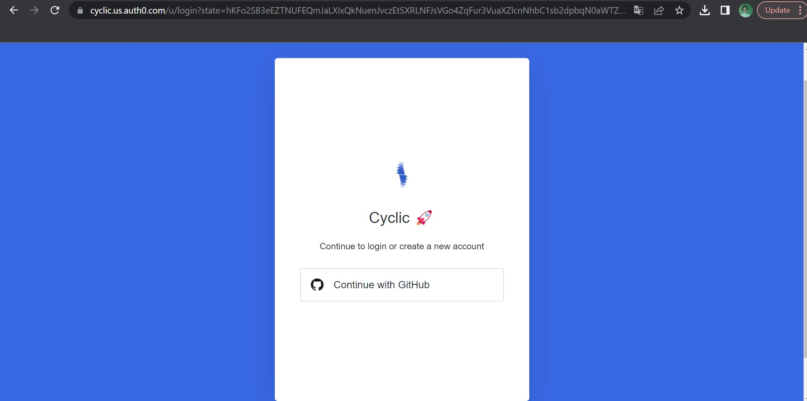

Deploy Some Code! - Quick Start - Deploy to Cyclic
------------------------

Deploy Some Code - DIY
----------
> Sign up: https://app.cyclic.sh/api/login

> Using github as your login
> Choose "Link my own", and type in your repo name
> Click deploy
> Approve "Cyclic - Preview" app in github
> Watch the terminal for your deployment logs
