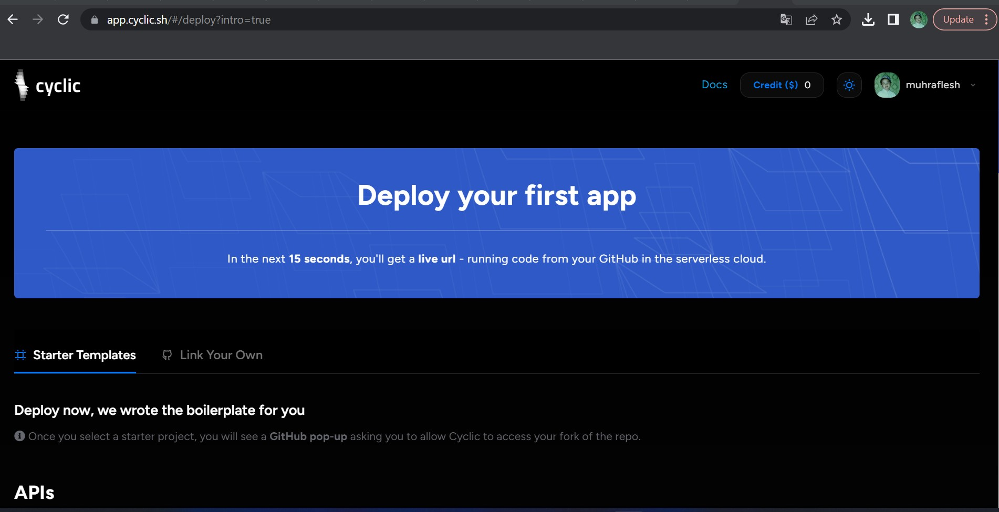
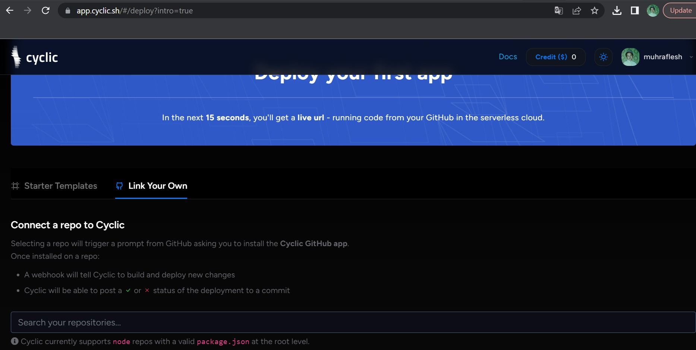
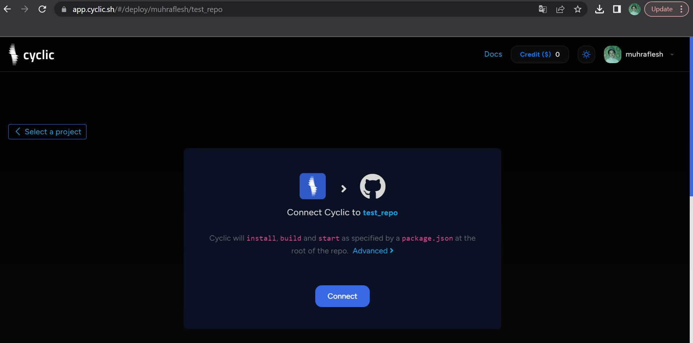
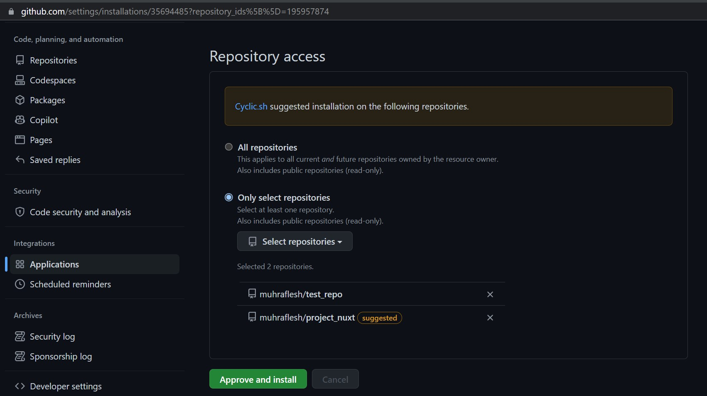
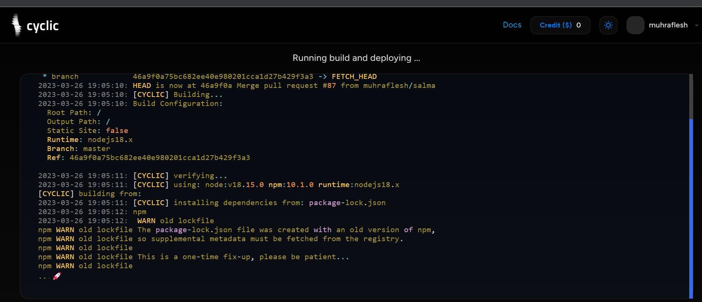

Deploy Some Code - DIY
----------
> Sign up: https://app.cyclic.sh/api/login

> Using github as your login

> Choose "Link my own", and type in your repo name

> Click connect

> Approve "Cyclic - Preview" app in github

> Watch the terminal for your deployment logs

