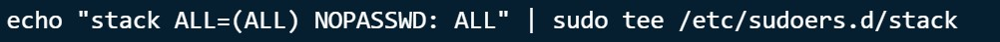

Install DevStack
----------
> Step 1: Update Ubuntu system

Masuk ke sistem Ubuntu lalu lakukan update.

Restart system setelah upgrade

> Step 2: Add Stack User

Aktifkan sudo privileges untuk user ini tanpa memerlukan password.

Switch ke stack user untuk testing.

> Step 3: Download DevStack

Clone Destack code dari Github.

Membuat file local.conf dan isikan dengan passwords and IP Host

Tambahkan :

> Step 4: Start Openstack Deployment on Ubuntu

Proses ini akan memakan waktu kira-kira 15-20 menit

> Step 5: Access OpenStack Dashboard

