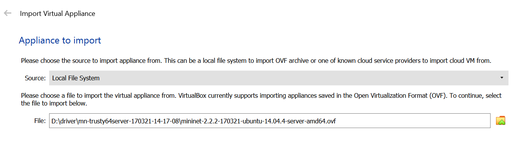
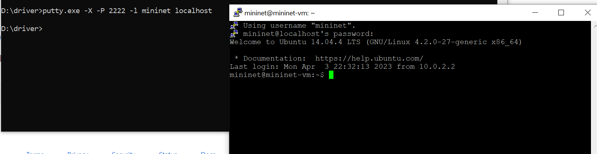

OpenFlow
----------

> Step 1: Installing required Software

Untuk melakukan installasi Virtual Machine Image dapat didownload pada :  
https://github.com/mininet/mininet/releases/download/2.2.2/mininet-2.2.2-170321-ubuntu-14.04.4-server-amd64.zip

> Step 2: Setup Virtual Machine

Jalankan VirtualBox, lalu pilih File->Import Appliance dan pilih image .ovf yang telah diunduh.

Selanjutnya, setelah klik import, lakukan setting pada network adapter 2 dengan memilih host-only adapter, seperti berikut :

Kemudian jalankan virtualbox image dan login menggunakan username dan password mininet

Setting interface dengan perintah :

Setting up Port Forwarding

> Step 3: SSH Connections after set up Port Forwarding

Pada windows jalankan perintah

