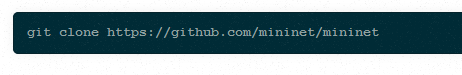
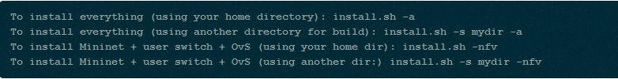
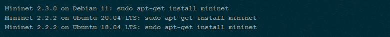
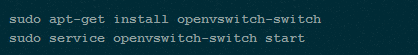
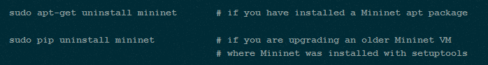

Walkthrough 
-------------------

> Clone projek mininet

> Opsi install.sh meliputi:

    -a: instal semua yang termasuk dalam Mininet VM, termasuk dependensi seperti Open vSwitch serta tambahan seperti OpenFlow wireshark dissector dan POX. Secara default alat ini akan dibangun di direktori yang dibuat di direktori home Anda.

    -nfv: instal Mininet, sakelar referensi OpenFlow, dan Buka vSwitch

    -s mydir: gunakan opsi ini sebelum opsi lain untuk menempatkan sumber/bangun pohon di direktori tertentu daripada di direktori home Anda

> Instal paket Mininet dasar dengan memasukkan hanya satu dari perintah berikut, sesuai dengan distribusi yang Anda jalankan:

> Jika Mininet menginfokan bahwa Open vSwitch tidak berfungsi, maka pastikan sudah terinstal dan berjalan:

> Upgrade mininet

