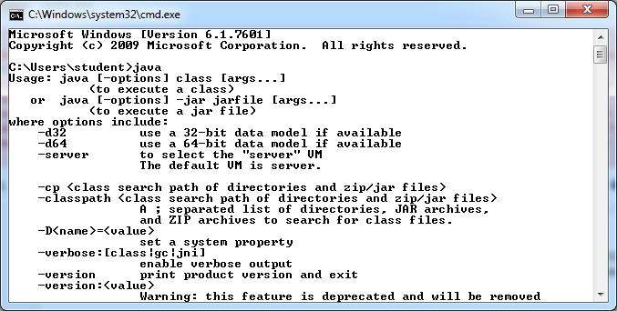
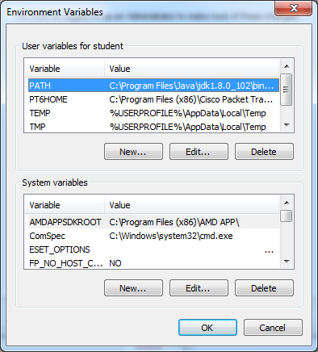
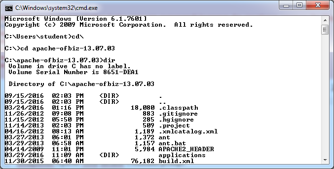
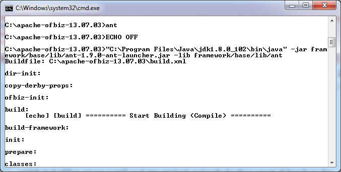
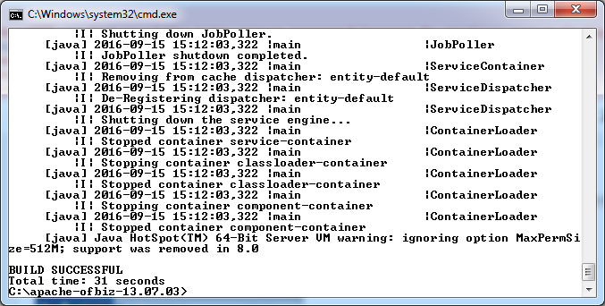
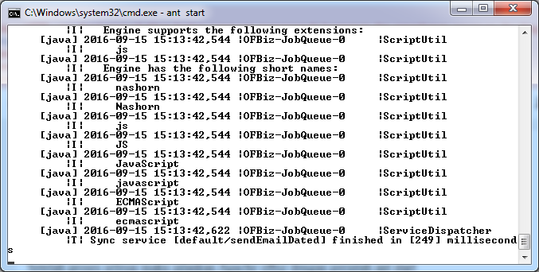
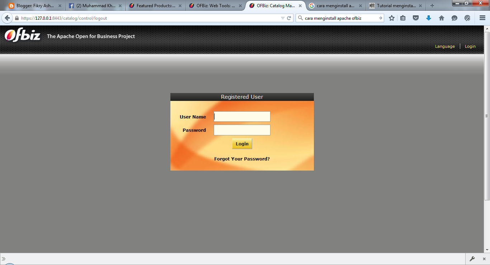
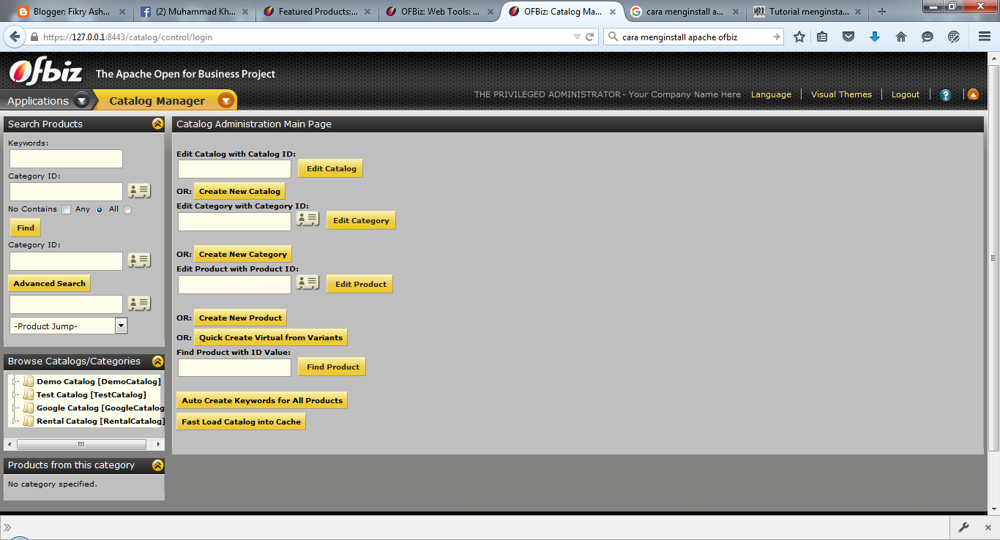

Install & Menjalankan Apache OFBiz
----------
> Step 1: Sebelum menginstall Apache ofbiz pastikan laptop sudah terinstal Java terlebih dahulu

> Step 2: Ekstrak file grandel dan apache ofbiz yang telah di download

Copykan folder kedua file yang telah diekstrak tadi ke path yang ada di system variabel 

> Step 3: Install Apache ofbiz

Buka command prompt cari folder apache ofbiz yang sudah diekstrak

Install gradle atau apache ant untuk mengkompilasi source code menjadi executable

Ketik ant load-demo untuk mengisikan data ke database demo

Jalankan Apache ofbiz dengan perintah ant start

> Step 4: Akses Apache OFBiz

Ketik https://127.0.0.1:8443/catalog/control/main di web browser

Masukkan username dan password

