Installasi Go
----------
> Step 1: Download installer terlebih dahulu

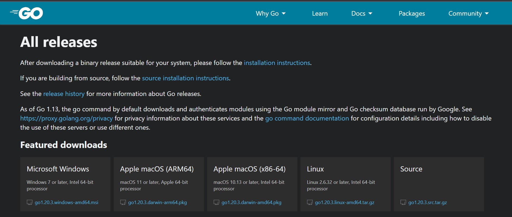

> Step 2: Go akan ter-install di C:\go. Path tersebut secara otomatis akan didaftarkan dalam PATH environment variable.

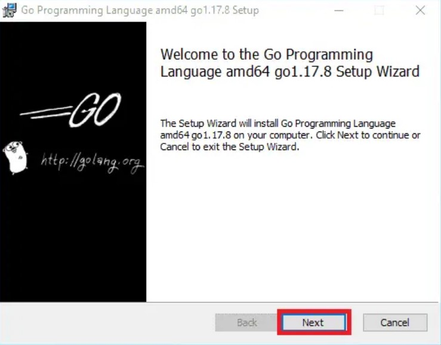

> Step 3: Buka Command Prompt / CMD, eksekusi perintah berikut untuk mengecek versi Go

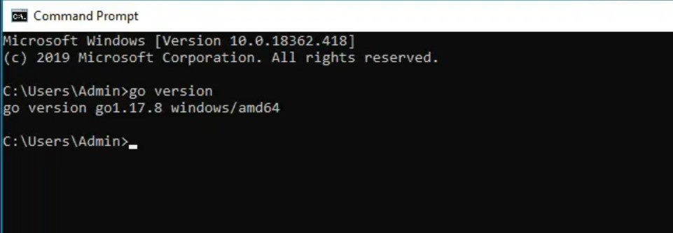

Installasi Mysql
----------
> Pada laptop sudah terinstall Mysql

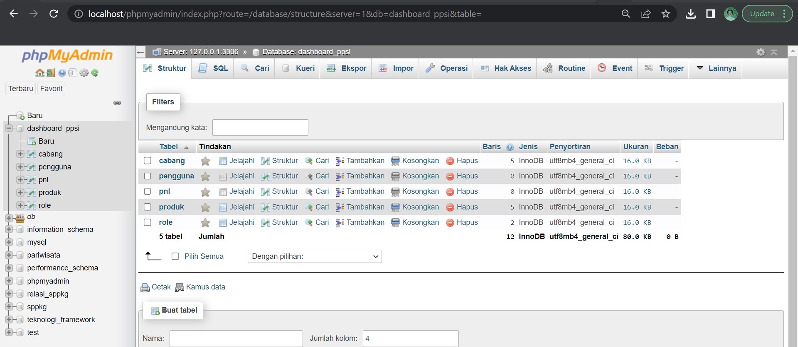

Installasi MongoDB
----------
> Step 1 : Download Installer 

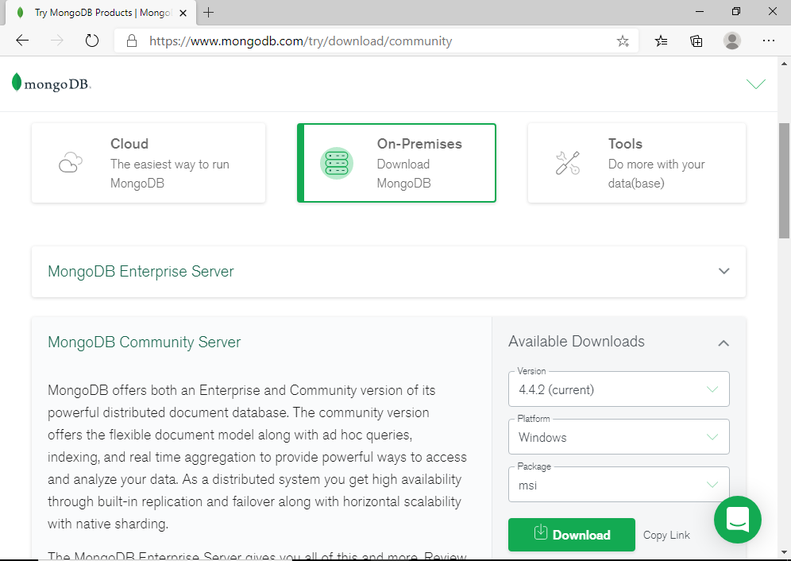

> Step 2 : Open file installer 

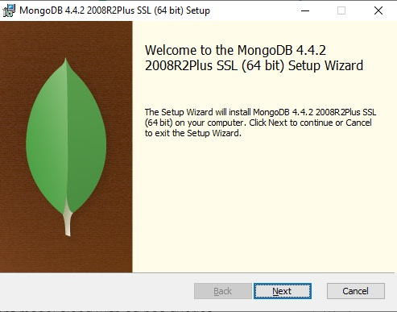

> Step 3 : Click Accept & Next

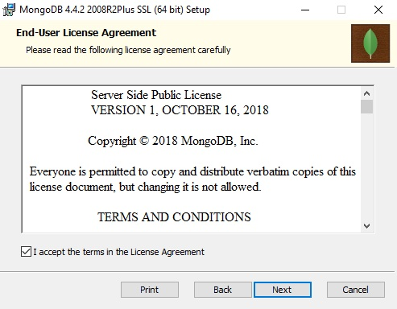

> Step 4 : Tampilan ini memungkinkan untuk memilih apakah akan menginstal atau tidak (default) setting lengkap, atau memilih penyetelan kustom

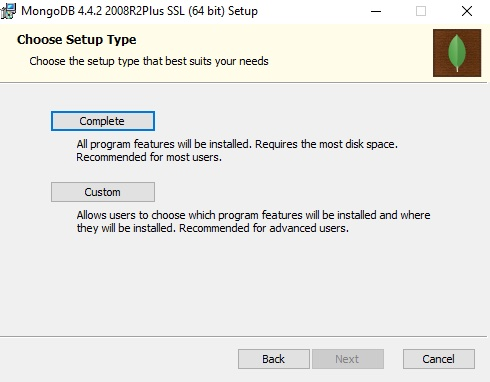

> Step 5 : Pada step ini, kita memiliki pilihan untuk menjalankan MongoDB sebagai layanan jaringan, atau sebagai pengguna lokal atau domain. 

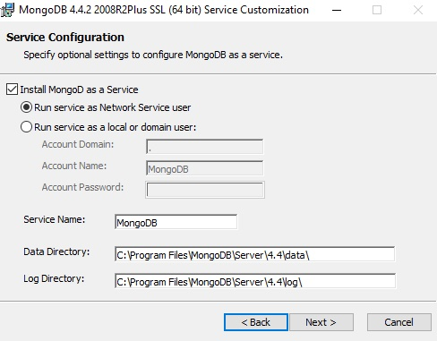

> Step 6 : Kompas MongoDB adalah tools GUI untuk mengelola MongoDB

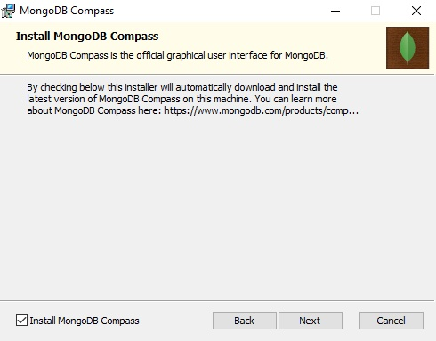

> Step 7 : Klik Instal untuk menginstal MongoDB.

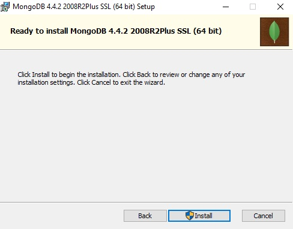

> Step 8 : Klik yes untuk mengizinkan aplikasi melakukan perubahan pada perangkat

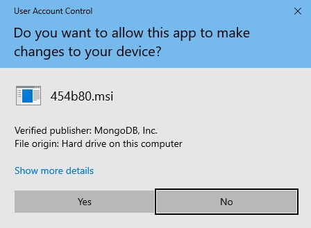

> Step 9 : Install mongodb berhasil

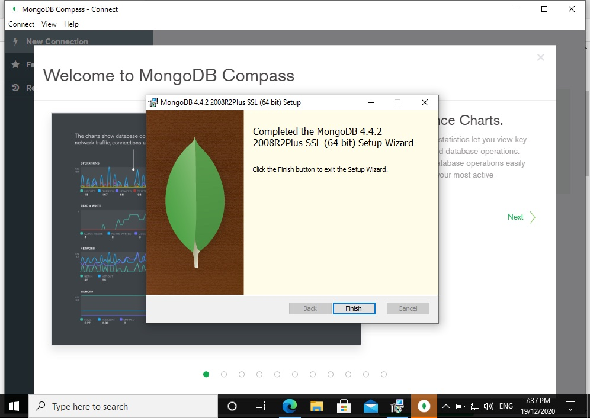
