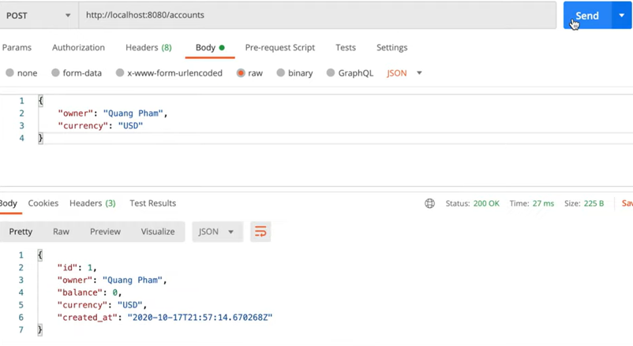
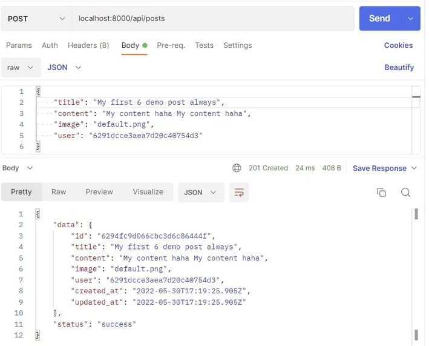

Program
----------
> Koneksi ke mysql

```
package main

import (
	"database/sql"
	"fmt"

	_ "github.com/go-sql-driver/mysql"
)

const (
	host     = "mydemoserver.mysql.database.azure.com"
	database = "quickstartdb"
	user     = "myadmin@mydemoserver"
	password = "yourpassword"
)

func checkError(err error) {
	if err != nil {
		panic(err)
	}
}

func main() {

	// Initialize connection string.
	var connectionString = fmt.Sprintf("%s:%s@tcp(%s:3306)/%s?allowNativePasswords=true", user, password, host, database)

	// Initialize connection object.
	db, err := sql.Open("mysql", connectionString)
	checkError(err)
	defer db.Close()

	err = db.Ping()
	checkError(err)
	fmt.Println("Successfully created connection to database.")

	// Drop previous table of same name if one exists.
	_, err = db.Exec("DROP TABLE IF EXISTS inventory;")
	checkError(err)
	fmt.Println("Finished dropping table (if existed).")

	// Create table.
	_, err = db.Exec("CREATE TABLE inventory (id serial PRIMARY KEY, name VARCHAR(50), quantity INTEGER);")
	checkError(err)
	fmt.Println("Finished creating table.")

	// Insert some data into table.
	sqlStatement, err := db.Prepare("INSERT INTO inventory (name, quantity) VALUES (?, ?);")
	res, err := sqlStatement.Exec("banana", 150)
	checkError(err)
	rowCount, err := res.RowsAffected()
	fmt.Printf("Inserted %d row(s) of data.\n", rowCount)

	res, err = sqlStatement.Exec("orange", 154)
	checkError(err)
	rowCount, err = res.RowsAffected()
	fmt.Printf("Inserted %d row(s) of data.\n", rowCount)

	res, err = sqlStatement.Exec("apple", 100)
	checkError(err)
	rowCount, err = res.RowsAffected()
	fmt.Printf("Inserted %d row(s) of data.\n", rowCount)
	fmt.Println("Done.")
}
```


> Koneksi ke mongodb

```
package main

import (
    "context"
    "log"

    "go.mongodb.org/mongo-driver/mongo"
    "go.mongodb.org/mongo-driver/mongo/options"
    "go.mongodb.org/mongo-driver/mongo/readpref"
)

func main() {
    c := GetClient()
    err := c.Ping(context.Background(), readpref.Primary())
    if err != nil {
        log.Fatal("Couldn't connect to the database", err)
    } else {
        log.Println("Connected!")
    }
}

func GetClient() *mongo.Client {
    clientOptions := options.Client().ApplyURI("mongodb://localhost:27017")
    client, err := mongo.NewClient(clientOptions)
    if err != nil {
        log.Fatal(err)
    }
    err = client.Connect(context.Background())
    if err != nil {
        log.Fatal(err)
    }
    return client
}
```

> Mengambil data pada database mysql




> Mengambil data pada database mongodb


