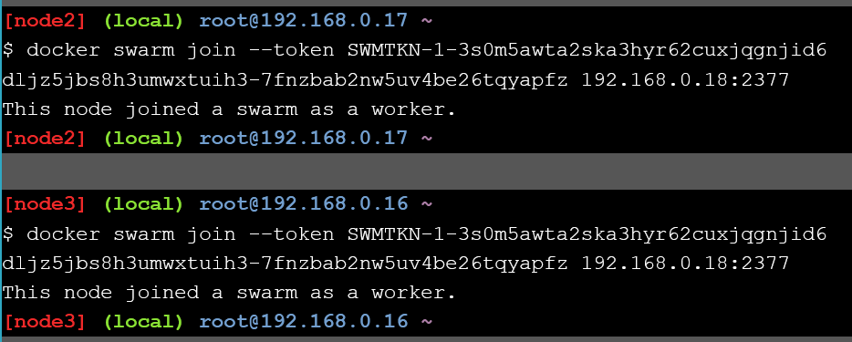

### Section #1 - What is Orchestration
So, what is Orchestration anyways? Well, Orchestration is probably best described using an example. Let’s say that you have an application that has high traffic along with high-availability requirements. Due to these requirements, you typically want to deploy across at least 3+ machines, so that in the event a host fails, your application will still be accessible from at least two others. Obviously, this is just an example and your use-case will likely have its own requirements, but you get the idea.

### Section #2 - Configure Swarm Mode
1. Running things manually and on a single host would be to create a new container on node1 by running docker run -dt ubuntu sleep infinity

2. You can verify our example container is up by running docker ps on node1.

#### Step 2.1 - Create a Manager node
1. Run docker swarm init on node1.

2. Run the docker info command to verify that node1 was successfully configured as a swarm manager node.

#### Step 2.2 - Join Worker nodes to the Swarm
1. Copy and paste command from output docker swarm node1 to terminal of node2 and node3.

2. Switch back to node1, and run a docker node ls to verify that both nodes are part of the Swarm

### Section #3 - Deploy applications across multiple hosts
#### Step 3.1 - Deploy the application components as Docker services
1. Let’s deploy sleep as a Service across our Docker Swarm.

2. Verify that the service create has been received by the Swarm manager.

### Section #4 - Scale the application
1. Scale the number of containers in the sleep-app service to 7 with the docker service update --replicas 7 sleep-app command. replicas is the term we use to describe identical containers providing the same service.

2. We are going to use the docker service ps sleep-app command. If you do this quick enough after using the --replicas option you can see the containers come up in real time.

3. Scale the service back down to just four containers with the docker service update --replicas 4 sleep-app command

### Section #5 - Drain a node and reschedule the containers
1. Take a look at the status of your nodes again by running docker node ls on node1.

2. We are going to take the ID for node2 and run docker node update --availability drain yournodeid. We are using the node2 host ID as input into our drain command. Replace yournodeid with the id of node2.

3. Lastly, check the service again on node1 to make sure that the container were rescheduled. You should see all four containers running on the remaining two nodes.

### Cleaning Up
1. Execute the docker service rm sleep-app command on node1 to remove the service called myservice

2. Execute the docker ps command on node1 to get a list of running containers

3. You can use the docker kill <CONTAINER ID> command on node1 to kill the sleep container we started at the beginning.

4. Lets run docker swarm leave --force on node1.
